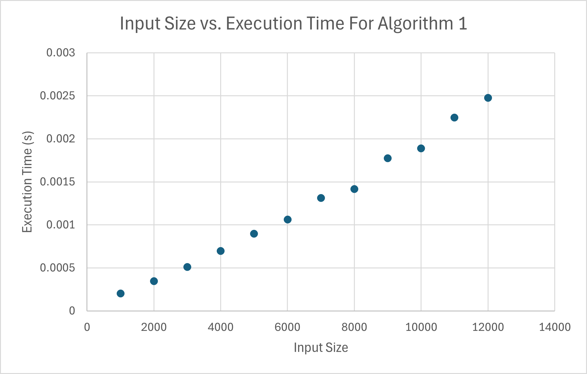
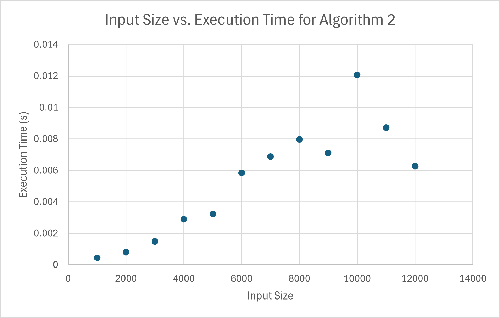

# Experimental Comparative Study

## Method
We have devised a system to easily test Algorithms 1 and 2 in *program1.py* and *program2.py*, using some constants and Python's CSV library to generate a CSV file. These tests will use an integer value in $\mathbb{Z^+}$, and generate sets of Problem S1 and Problem S2 instances for each algorithm, respectively. In *program1.py*, the value, say, $x$, will be used to generate $x$ multiples of $1000$ elements from $1$ to $x$ inclusive, whose elements begin at $x * 1000$ and decrease to $1$. In *program2.py*, the elements are randomly generated, as well as the index of the minimum, but the output fits the problem description. 

Each run of $n$ elements is performed a specific number of times $c$, where $c$ runs are then averaged to get the performance time for $n$ elements. 

## Performance Comparison
For our tests, we used twelve multiples of $1000$ for our input sizes, meaning each algorithm was tested on $[1000, 2000, \cdots, 12000]$ elements. Algorithm 1 was tested on a randomly generated then sorted list of numbers from $1$ to $n * 1000$.

For Algorithm 2, we used a randomly generated number from $2$ to $1000$ for each element in the first half, then sorted the first half in descending order. The midpoint was determined randomly, and was always set to a value of $1$. The second half was generated the same way as the first, only now in ascending order. These sections were combined to generate a list of elements in the following pattern:
- For $n$ elements, the test set could resemble $[1000, 448, 362, \cdots, 1, \cdots, 2, 992, 993]$.

### Data

| Algorithm 1                |                           | Algorithm 2                |                           |
|----------------------------|---------------------------|----------------------------|---------------------------|
| **Input Size**             | **Execution Time (s)**    | **Input Size**             | **Execution Time (s)**    |
| 1000                       | 0.000193                  | 1000                       | 0.000343                  |
| 2000                       | 0.000364                  | 2000                       | 0.000812                  |
| 3000                       | 0.000541                  | 3000                       | 0.001047                  |
| 4000                       | 0.000715                  | 4000                       | 0.001566                  |
| 5000                       | 0.000877                  | 5000                       | 0.003689                  |
| 6000                       | 0.001098                  | 6000                       | 0.004294                  |
| 7000                       | 0.001276                  | 7000                       | 0.005829                  |
| 8000                       | 0.001484                  | 8000                       | 0.004366                  |
| 9000                       | 0.001673                  | 9000                       | 0.003972                  |
| 10000                      | 0.001980                  | 10000                      | 0.008214                  |
| 11000                      | 0.002158                  | 11000                      | 0.009492                  |
| 12000                      | 0.002307                  | 12000                      | 0.012766                  |

### Analysis
It is evident that Algorithm 1 closely follows an $O(n)$ performance time as input size scales linearly. Algorithm 2 does the same, however it seems to be more prone to performance fluctuations, as outliers become more common with larger input sizes. That being said, both algorithms perform very quickly compared to the time of human actions, with the longest performance time still being hardly longer than $\frac{1}{100}^{th}$ of a second at $12000$ elements. Nonetheless, it is clear our algorithms are consistent and could be used in practical applications suitable for the problem description with negligible performance overhead. 