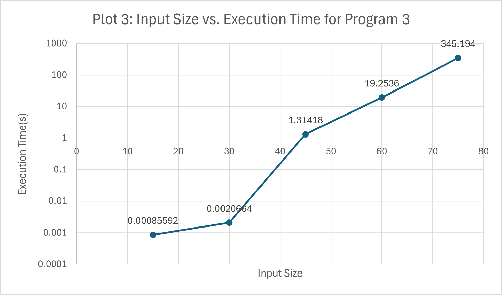
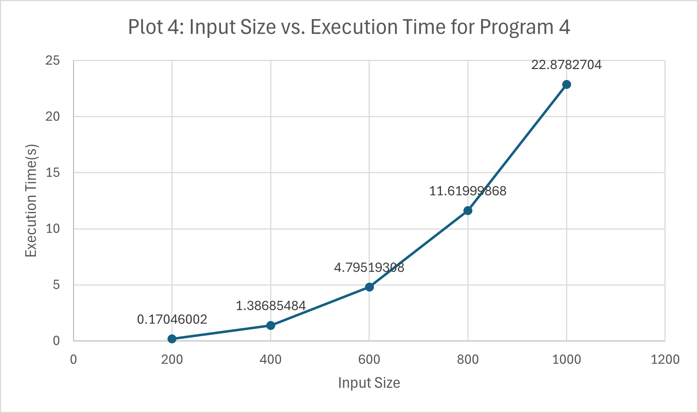
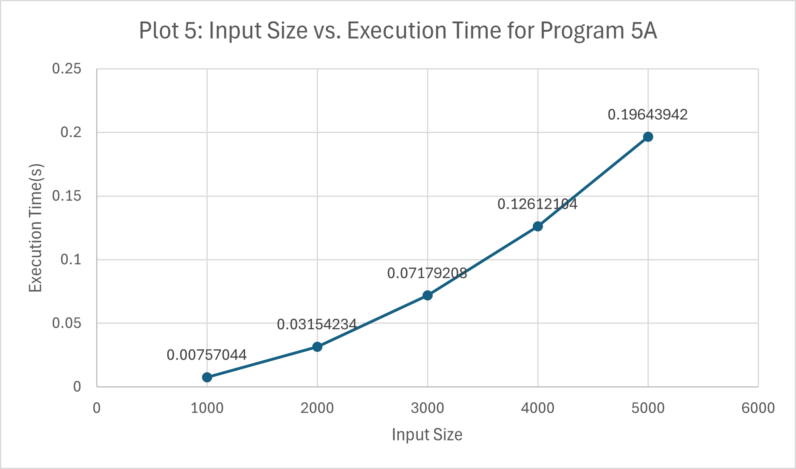
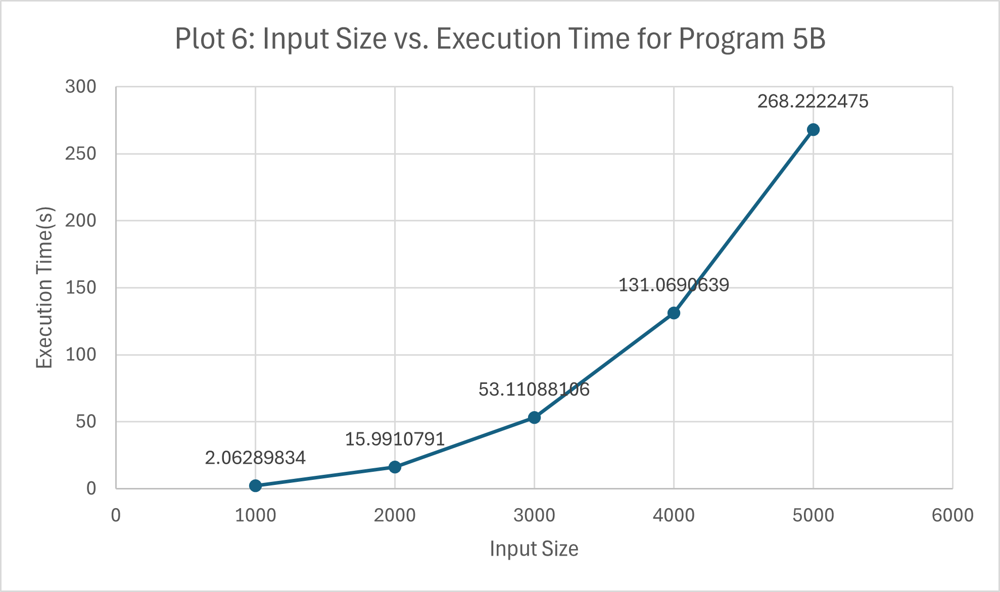
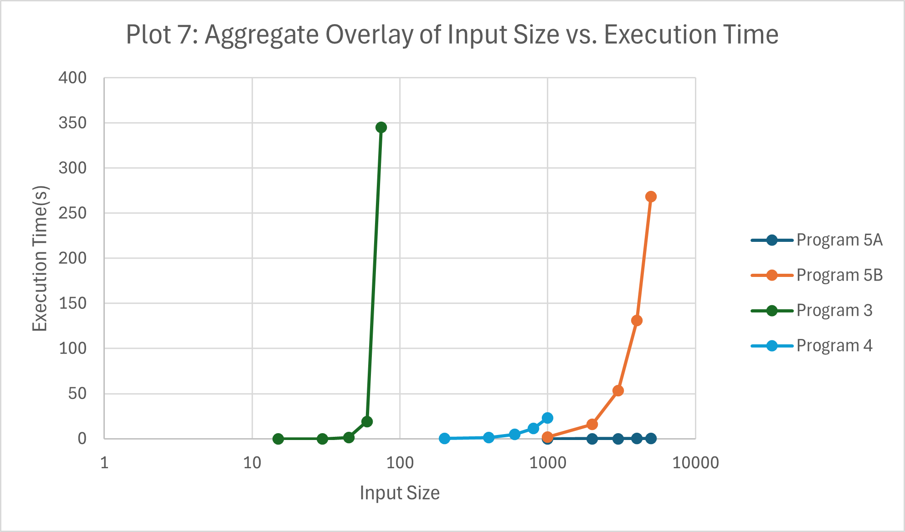
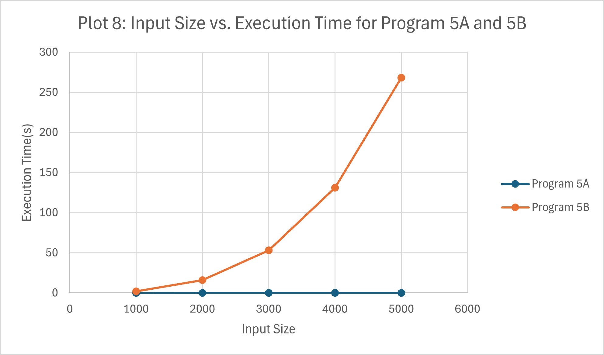
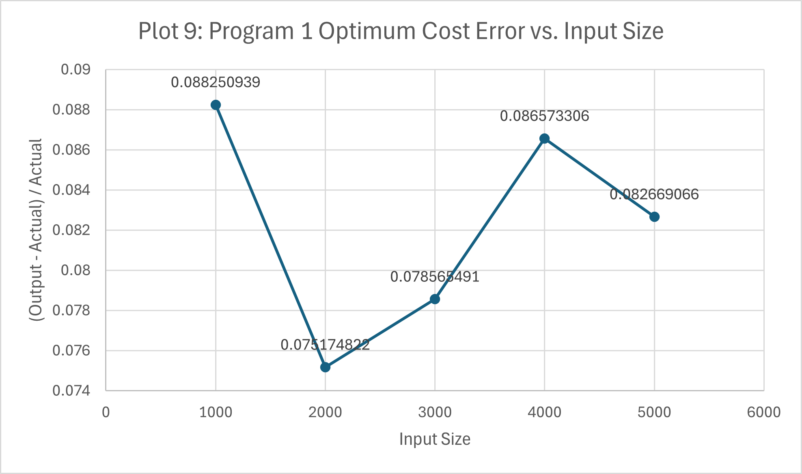

# Experimental Comparative Study

## Method
For Milestone 2, we had program3 written in C++, and programs 4, 5A, and 5B written in Python. As such, program3 was tested individually, but all the tests followed the same format. 

We used five tests for each program, with varying numbers of elements for each. The heights in these tests use a random set of integers in $\mathbb{Z^+}$, where the length of the test set is equivalent to $5$ increasing multiples of $15$ for program3, and $5$ increasing multiples of $1000$ for 4, 5A, and 5B. The difference in the multiple sizes is due to the necessary execution time, as program3 is exponential and a minimum of $1000$ elements would have a worst-case time complexity of $1000 * 2^{1000}$. We simply do not have enough time as a species to test this way. 

Widths are generated as a random number $1$ through $10$ for the same length as the list of heights. The maximum row width is always constant throughout our tests. 

Each test was run five times and averaged to get the performance time for the specified number of elements, and then the dataset size and average time were ouput in a single row in a CSV file for that program, with the number of data rows equaling the number of multiples. 

## Performance Comparison
For our tests, we used five multiples of $15$ for program3, and five multiples of $1000$ for program4, 5A, and 5B. We decided this difference was necessary while waiting excessively for test results from program3. Test set sizes for program3 include: $[15, 30, 45, 60, 75]$. Test set sizes for program4, 5A, and 5B include $[1000, 2000, 3000, 4000, 5000]$. 

Again, heights are randomly generated for a list whose length is equal to each of the aforementioned sizes, and widths are randomly generated $1$ through $10$ for the same size as each height list. Each size has *one* corresponding randomly generated list, which is tested five times in this case, since we wanted the average of five runs. 

Executions of programs 4, 5A, and 5B must occur separately since one test file was written for modularity, and so operate on the same list sizes, but not the same list contents. 

#### NOTE: Plot 3 is logarithmic in base $10$ for Execution Time. Plot 7 is logarithmic in base $10$ for Input Size. 

### Data

| Algorithm 3                |                           | Algorithm 4                |                           |
|----------------------------|---------------------------|----------------------------|---------------------------|
| **Input Size**             | **Execution Time (s)**    | **Input Size**             | **Execution Time (s)**    |
| 15                         | 0.000856                  |                            |                           |
| 30                         | 0.002066                  |                            |                           |
| 45                         | 1.31418                   |                            |                           |
| 60                         | 19.2536                   |                            |                           |
| 75                         | 345.194                   |                            |                           |

| Algorithm 5A               |                           | Algorithm 5B               |                           |
|----------------------------|---------------------------|----------------------------|---------------------------|
| **Input Size**             | **Execution Time (s)**    | **Input Size**             | **Execution Time (s)**    |
| 1000                       | 0.00757                   | 1000                       | 2.062898                  |
| 2000                       | 0.031542                  | 2000                       | 15.99108                  |
| 3000                       | 0.071792                  | 3000                       | 53.11088                  |
| 4000                       | 0.126121                  | 4000                       | 131.0691                  |
| 5000                       | 0.196439                  | 5000                       | 268.2222                  |

### Analysis
There are a few major points of interest. To begin, Program3 is set on a logarithmic curve in base $10$ to better illustrate how its performance scales with input size. It climbs extremely rapidly, even for a C++ implementation, as compared to the Python versions for the others. Nonetheless, program3 obviously ahs the worst performance of all the algorithms, as made evident by its exponential time complexity. This was to be expected, and it was quite difficult to test the algorithm and determine realistic values for input sizes. 

Programs 5A and 5B do follow relatively the same rate of growth against input size, but when placed next to each other, it becomes evident that 5A, the top-down implementation of Algorithm 5, performs substantially better than 5B. We believe this is because iteratively computing all possible values $\text{OPT}(1)$ to $\text{OPT}(n)$ is likely to be slower than recursively computing them *as-needed*. 5A also has the best performance of all the programs, which was the rationale for its use in the following comparison. 

### Program 1 vs. Program 5A Accuracy Comparison
To test how wrong program1 is compared to an optimal algorithm, we used the same testing strategies as before, except the data being examined is $\frac{(h_g - h_o)}{h_o}$, where $h_o$ is the optimal height of program5A, and $h_g$ is the greedy height of program1. We used randomly generated heights in lists of size $[1000, 2000, 3000, 4000, 5000]$, with a constant max width of $10$ and randomly generated painting widths from $1$ to $10$. 

#### Data

#### NOTE: $\frac{(h_g - h_o)}{h_o}$ is represented as $\frac{(\text{Output - Actual})}{Actual}$. 

| **Input Size** | **Program 1 Optimum Cost Error** | **Program 1 Optimum Cost Error %** |
|----------------|----------------------------------|------------------------------------|
| 1000           | 0.088251                         | 8.8251                             |
| 2000           | 0.075175                         | 7.5175                             |
| 3000           | 0.078565                         | 7.8565                             |
| 4000           | 0.086573                         | 8.6573                             |
| 5000           | 0.082669                         | 8.2669                             |

#### Analysis
Examining the data, it is evident that the greedy algorithm overshoots the minimum every time. Its output *must* be a greater cost than that of the optimum solution, obtained from program5A, our top-down implementation of Algorithm 5. Program1, and therefore Algorithm 1, is not sufficient to solve Problem G, as it does not cover all possible solutions. It does not have an "undo" mechanism to allow for decisions, it simply takes the best possible option at every step. 

To determine exactly how far off Program 1 is, we can multiply its error values by $100$ to convert them into percents, as seen in the table. 

We observe that, on average, Program 1 is off by $\approx8.2\%$ from the actual value. The actual value of its inaccuracy tends to vary, but in all five cases it did not correctly determine the optimal minimum cost arrangement of paintings. 